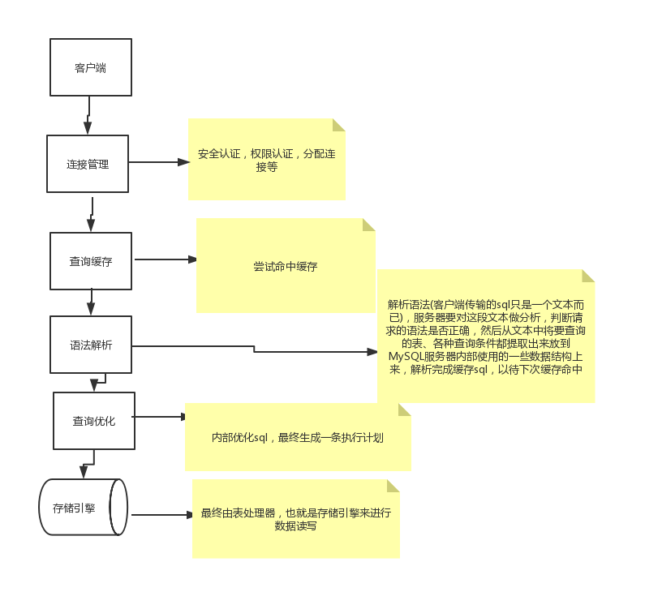
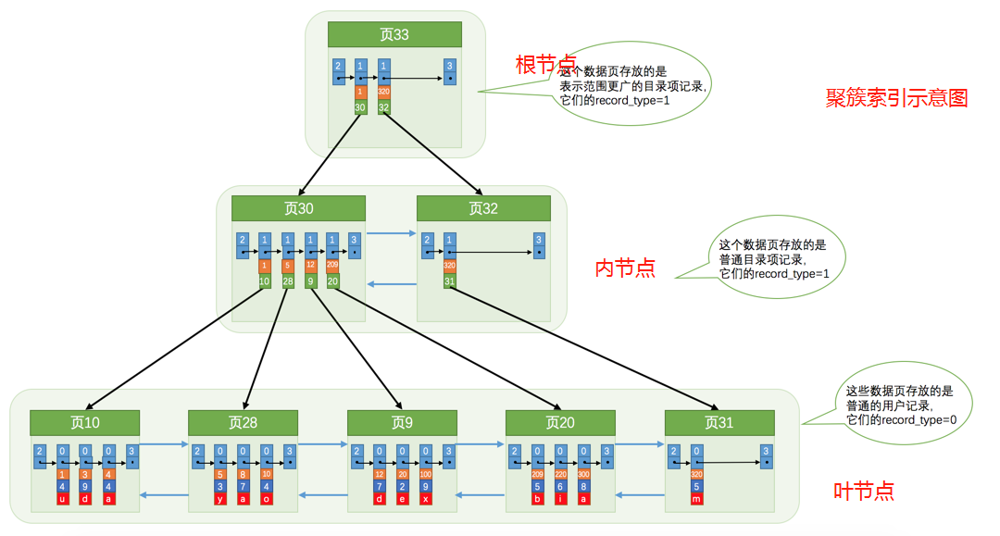

## 背景
拜读过高性能mysql，有些东西比较晦涩难懂，从58沈剑的文章里找到这个专栏，打算拜读一番

图片和资料参考来自于掘金小册:[MySQL是怎样运行的从根上理解MySQL](https://juejin.im/book/5bffcbc9f265da614b11b731/section/5bffdbf06fb9a049f570dc4f#heading-1)

参考资料:[innodb存储结构](https://github.com/jeremycole/innodb_ruby)
## 阅读笔记
### sql执行流程

### 索引的笔记
#### 前置
目录项:存放页中最小主键和页号

目录项页:存放多个目录项，按照主键从小到大排序进行串联形成链表

记录数据和目录项都是同一种存储格式，实际以数据的头信息record_type来区分

每个索引都对应一棵B+树，B+树分为好多层，最下边一层是叶子节点，其余的是内节点。所有用户记录都存储在B+树的叶子节点，所有目录项记录都存储在内节点。

B+树中每层节点都是按照索引列值从小到大的顺序排序而组成了双向链表，而且每个页内的记录（不论是用户记录还是目录项记录）都是按照索引列的值从小到大的顺序而形成了一个单链表。如果是联合索引的话，则页面和记录先按照联合索引前边的列排序，如果该列值相同，再按照联合索引后边的列排序。

通过索引查找记录是从B+树的根节点开始，一层一层向下搜索。由于每个页面都按照索引列的值建立了Page Directory（页目录），所以在这些页面中的查找非常快。
#### 聚簇索引
mysql会针对主键创建聚簇索引，不指定主键，mysql会为你创建主键
聚簇索引的形式为二叉树的结构，叶节点也就是一个个数据页作为节点，用来
存放用户的实际记录数据，按照主键大小排序形成单链表，内节点存放目录项页，节点与节点之间按照索引列形成双向链表，
然后这时候就可以通过主键查找根节点，找到到目录项页，再查找到目录项，然后找到具体的数据页，通常使用二分法来做查找
可参考此图:

#### 二级索引和联合索引
其他的手动创建的索引可以称为二级索引，内节点是由索引列排序后组成双向链表构成的目录，
但是这种二级索引的记录数据只会存储索引列和主键，在找到这个列后会拿主键去做一次回表操作，也就是再去聚簇索引查一遍，
对于联合索引来说，内节点存储的是所有联合键排序后的目录项，记录数据存储的是联合键和主键，也是需要做回表操作
#### 联合索引为什么需要满足最左前缀
因为联合索引的排序是把字段从左到右排序的，如果没有最左边的条件的话，那么其他字段有可能是乱序的，这个时候就用不到索引，
比如假如有a，b，c三个字段，a字段值一样就按照b排序，b一样就按照c排序，假如条件没有了a，那么b可能并不是有序的
参考此图:

#### 索引的劣势
占用更大的存储空间，每创建一个索引，都会创建一个b+tree，而每个b+tree都会有很多很多的数据页组成，每个数据页16kb，数据量大的话，
索引的体积也会很庞大，时间上，每次一次增删改都有可能会触发记录移位，页分裂等来保证索引列在节点和记录上的顺序性，这样就会影响性能

